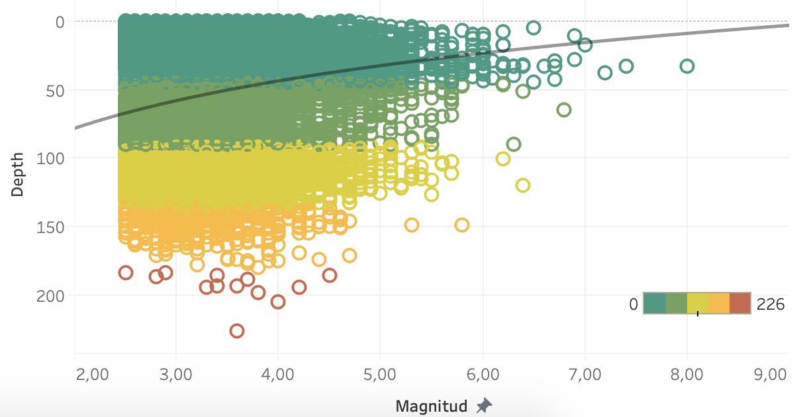
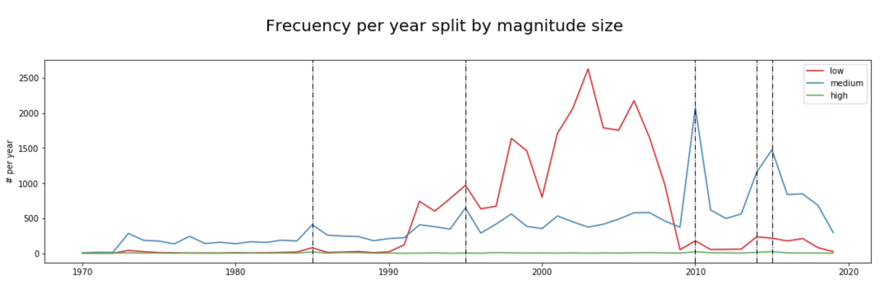
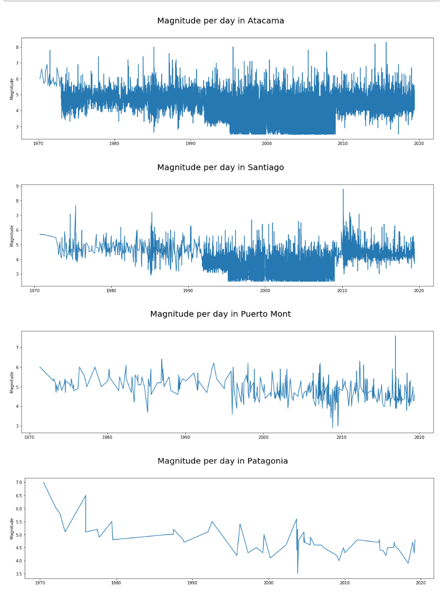
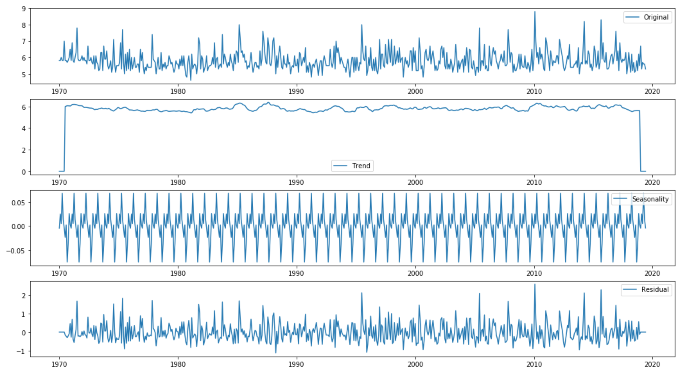
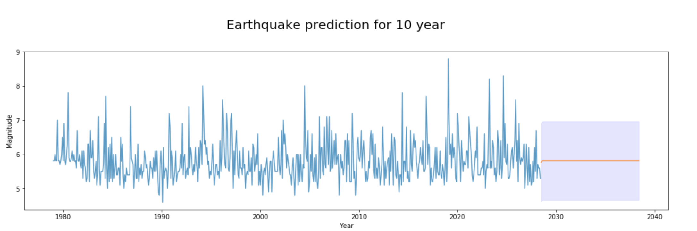
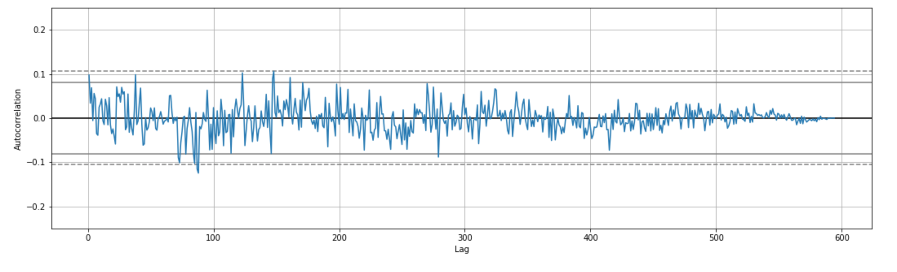
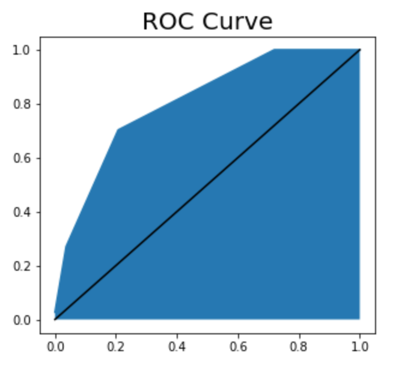
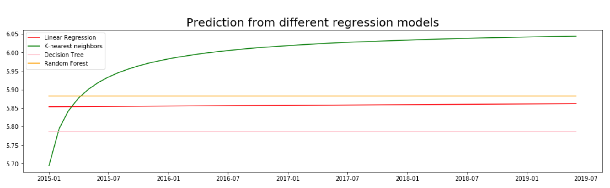

# Data Science Master's thesis - Earthquake Prediction

## 0. INTRODUCTION

Due to my period living in Chile, I am afraid of earthquakes and I think that analyzing the data collected about these phenomena can help me in this regard.

With this work I don't try to predict future earthquakes, I know that it's not possible. My intention is to know them a little bit better and practice some of the models learned during my Master of Data Science.

### Code Structure

* `TFM_1_Scraping.ipynb` notebook to download earthquake data from website.

* `TFM_2_Memo.ipynb` notebook where code in [models] folder is executed and explained step by step. 

* [data]: folder where csv files are stored

* [front_end]
    * `TFM_TimeSeries.twb`: Tableau dashboard with 3 storys:
        1. Relation between depth and magnitude
        2. Grafic where historical and forecast data, related to maximum magnitude per month/year, is displayed.
        3. Map where earthquakes are displayed with pagging by month/year
        
        Dashboard information can be filtered by area (Patagonia, Puerto Mont, Santiago, Atacama)
    * ¿? 
* [models]
    * `common.py`: get_logger and different plots methods
    * `read_data.py`: generate required data frames for analysis.
        1. read_data_common: From earthquake.csv file to sismos and all_months dataframes
        2. read_data_classification: from sismos and all_months dataframes and Temperature.csv file to features_classification dataframe and label_classification series
        3. read_data_time_series: from sismos and all_months dataframes to frequency_year, time_series_magnitude dataframes
    * `supervised_models.py`: contains Supervided class with methods for crossvalidation, gridsearchcv and one to find the best model evaluating differents parameters in different models 
    * `time_series.py`: contains TimeSeries class with methods for decompose the series and for Dickey Fuller test
    
* [test]: 
    * `unit_test.py`: project unit test to verify everithing is still working after code updates. 
    
### Index

This work is divided in 3 parts:

1. Data Processing and Understanding,

2. Time Series (ARIMA and LSTM) 

3. Supervised learning models (Classification)

____________________________________________________________________________________________________________________________

## 1. Data Processing and Understanding

### 1.1. DataFrame used

:clipboard: **original_data**
Data downloaded from https://earthquake.usgs.gov/earthquakes/search/ in csv format.

1. For this analysis, we don't take into account 'magType' and we assume all the magnitudes measure the same beacuse:

    The Richter magnitude scale can only be used when seismographs are within 600 km of the earthquake. For greater distances, other magnitude scales have been defined. While not exactly the same as the original Richter magnitude, they give values that can range from less than 0.0 to over 9.0. For example, the surface wave magnitude, MS, is often used for large distant earthquakes. Most of these scales saturate at some magnitude and do not properly represent earthquake size for larger events. For example, the ML scale saturates over ML 6.0, while the MS scale can be used to about MS 8.0.

    The most modern scale is the moment magnitude scale MW, which can be used for a wide range of magnitudes and distances. This has been defined so that the numerical value is close to ML for earthquakes up to magnitude 6.0, and close to MS for magnitudes 6.0 to 8.0. The very largest earthquakes, such as experienced in Chile in 1960 or Alaska in 1964, can reach magnitudes larger than MW 9.0.

2. We discard information realted to the satation where data were collected.

:clipboard: **sismos** = original_data plus the following calculated columns:
* `date, hour, year and month`
* `YM`(=[year]-[month])
* `magtype` = {__low__: mag in [0,4), __medium__: mag in [4,6), __high__: mag in [6,10)}
* `region` = split data into 4 equals regions {Patagonia, Puerto Mont ,Santiago , Atacama} depending on latitude

:clipboard: **frequency_year** = number of seisms and maximun magnitude per year and magtype

:clipboard: **mag_ym** = maximun magnitude per month/year. Months without data are all from before 1991, I assume there were worst stations than now and not all seisms were collected. So I fill missing data with the average of maximum per month/year.

:clipboard: **features_classification** = ['YM', '2', '3', '4', '5', '6', '7', '8', 'Tempt', 'TemptUncert'] where YM reference to month/year and '2', '3', '4', '5', '6', '7', '8' contain the number of earthquakes of that magnitude and 'Tempt' and 'TemptUncert' are related to averange temperature on that month

:clipboard: **label_classification** this is a Series whose value are 1 if (next month has earthquakes > = 6) else is 0,
 so if we know the earthquakes magnitudes and temperatures of the current month, then I can predict next month
 ** = 

### 1.2. Conclusions

* The greater magnitude, the less depth

* Previous a big earthquake, the number of medium earthquake increases drastically

* The farther north the higher the frequency and the bigger magnitude

## 2. Time Series 

Time series = maximun magnitude per month/year

I have followed BOX-JENKINS methodology to study the time series. First I have analyzed all records at once, and after the data split by region. In both cases the prediction is almost a straight line, far away from reality.

### Decomposition

### Forecast

### Autocorrelation
As it is displayed in the following autocorrelation plot, this time series is completly random.

## 3. Classification 

The following models are fit with features_classification and label_clasification in order to evaluate wich one is better:

* LogisticRegression 
* KNeighborsClassifier: parameters tested: {'n_neighbors': np.arange(2, 10)})
* DecisionTreeClassifier: parameters tested: {'min_samples_leaf': np.arange(50, 300, 50),
                                             'max_depth': np.arange(2, 10)}),
* SVC: parameters tested : kernel="linear" and {'C': np.arange(1, 3)}),
* RandomForestClassifier': parameters tested : {'n_estimators': np.arange(1, 3),
                                                'max_depth': np.arange(1, 3),
                                                'min_samples_leaf': np.arange(1, 3)})}
                                                
The best one is:

`KNeighborsClassifier(algorithm='auto', leaf_size=30, metric='minkowski',
           metric_params=None, n_jobs=1, n_neighbors=4, p=2,
           weights='uniform')

Even with an Accuracy of 80% it is not a good model because it has 75.0% recall and 96.0% precision and I expect a higher recall, missing 25% of big earthqueake is quite high.

ROC curve

# 4. Regression.

The following regression models have been fit with time series data:

* LinearRegression
* KNeighborsRegressor(n_neighbors=10)
* DecisionTreeRegressor(max_depth=3)
* RandomForestRegressor(n_estimators = 40, max_depth = 12, min_samples_leaf = 50)
* 

This is the prediction from them:

